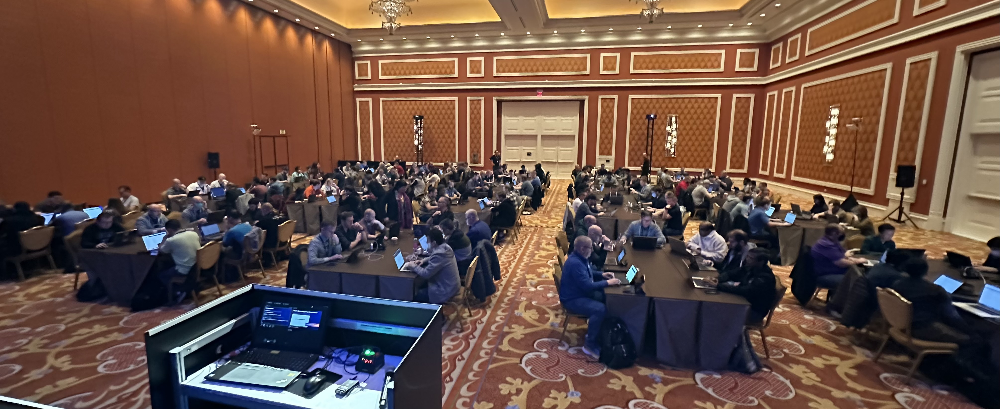
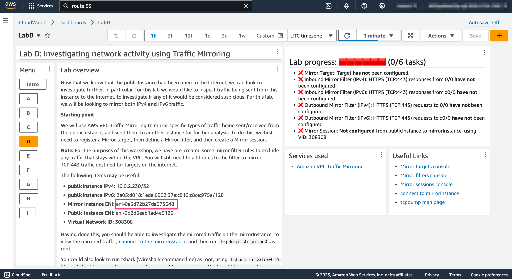
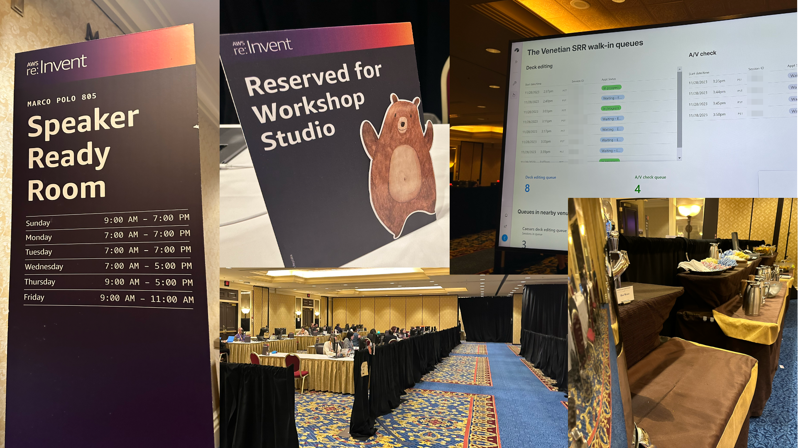

|ToC|
|---|

## Introduction
This year at re:Invent 2023, AWS delivered more than 300 hands-on workshop sessions across the 5 days of the event (this isn't including the 200+ Builders sessions and the 5 AWS GameDays).  This blog post dives deeper into how AWS design, build and deliver workshop sessions.

### What are AWS Workshops anyway?

Workshops are two-hour sessions where you work to solve problems or build solutions using AWS services.  Following a short (5-10 minute introduction), attendees then get hands-on with AWS, in pre-provisioned accounts.


***NET301 session at re:Invent 2023***

The room is typically organised into tables of 8-10 people to encourage interaction, giving you the opportunity to learn from and teach each other.  There are also several AWS staff around to help if needed.

## T-6 months: Selection & Planning

### Selection
Whilst we won't cover the selection process, it's worth calling out that the process for determining re:Invent content (sessions, workshops, chalk talks, etc) starts more than 6 months before the event itself; each track (such as networking, security, databases, etc) will have a core team of experts that will review content ideas from across AWS and beyond.  As you can imagine, there are **lots** of ideas submitted, and so this process will often involve consolidating ideas into the number of allocation sessions.  If you're lucky enough to be selected, this is when the hard work really begins!

### Developing the theme

The workshop Laura and I have developed for re:Invent 2023 (**NET301 - Approaches to layered security for Amazon VPC**) is an evolution of the one we ran at last year's event (**NET308 - Best practices for securing Amazon VPC**).  The concept of the workshop is to allow participants to go beyond the "basics" of VPC security controls (such as security groups, Network ACLs, VPC Flow Logs) and have a chance to get hands-on with some services they might not have used before.  Services we focus on include Route 53 query logging, DNS Firewall, AWS Network Firewall, Traffic Mirroring, AWS WAF, and Network Access Analyser.  This year we also added support for demonstrating IPv6, and the ability to create your own custom firewall capability using Gateway Load Balancer.

### Workshop design

One of the key outcomes we want from the workshop is for people to "learn by doing"; it is important to us that participants are able to try and solve things on their own initiative, without simply following detailed step-by-step instructions of which buttons to click for the 2 hours.  To this end, we came up with a design approach based loosely on the Perl slogan: "There's More than One Way to Do it".

First, the workshop is broken up into a number of separate tracks, allowing you to "choose your own adventure".  These tracks focus on DNS Security, Network Analysis, AWS Network Firewall, 3rd Party Network Firewall, and AWS WAF.  These tracks can be done in any order, and don't have any dependencies between them.  This is important - we don't want people getting stuck on one part of the workshop and then being unable to complete any other parts.

Within each track is one or two labs; these do have to be followed in the correct order, since the outcome of one lab will typically be needed to support the next lab.  For example, in the AWS Network Firewall track, the first lab focusses on the routing changes needed to integrate AWS Network Firewall into your VPC.  This is needed to start the second lab, which looks at the various firewall rules you can use to filter or alert on specific traffic types.

In order to make the labs as interactive as possible, we allow participants two different approaches; the first is to state the desired outcome in the workshop guide, provide a starting point, and offer some suggestions as to what services to use.  Participants are free to explore and learn by experimentation, but with the ability to look at hints if they need to.  Alternatively, if attendees feel more comfortable with a step-by-step walkthrough, we provide that as well.  The approaches can be mixed; you might start by experimenting, get stuck, and then dip into the walkthrough guide to help with a specific task.

So, with those concepts in mind, it's on to the building!

## T-5 months: Workshop Architecture

At its core, an AWS workshop consists of an AWS account, provisioned on behalf of the attendee, with an IAM role and pre-deployed resources, together with a set of Markdown-format documentation providing guidance on how to complete the workshop.  As workshop authors, we need to create the CloudFormation template that is pre-deployed into the Workshop Studio accounts, together with the documentation & guidance needed for attendees to complete the tasks.

### Workshop development environment: AWS Workshop Studio

For the past few years AWS workshops run at events such as Re:Invent have been developed and deployed using an internal capability called **AWS Workshop Studio**.  Inside AWS, we use this to design and develop the workshop documentation, code, account structures, permitted resources, and more.  From a development perspective, it uses a Git-based source code repo for both the documentation and code, with a whole bunch of automation to deploy micro-sites, etc.

When it comes to actually running the workshop, AWS Workshop Studio handles all of this heavy lifting, allowing us to safely and securely provision 100's of pre-configured AWS accounts and associated resources based on a workshop template, allow users to register for the workshop, and then provide time-boxed access to those accounts for workshop attendees.  The workshop code is deployed prior to the workshop being delivered, and then when the participants log into their accounts, they assume a role with the appropriate permissions needed to complete the workshop.

This is a **far** better experience than the approach I had to use at the first re:Invent workshop I ran back in 2017, when participants had to bring their own accounts, deploy resources before starting the labs, troubleshoot resource limits, IAM policies, etc.  It's also worth calling out that the AWS Workshop Studio team are amazing - more on that later!

### High-level design

Since this workshop was an evolution of our previous one, we weren't starting from scratch; however we did have to make a couple of significant modifications - the first was to integrate IPv6 concepts, and the second was to include the ability to get hands-on with Gateway Load Balancer (GWLB).  The first was reasonably straightforward, but the second presented some problems, since we already had a lab focussed on Network Firewall.  Since we were going for the ability for attendees to "choose their own adventure", we had to make sure that an attendee completing one track wouldn't interfere with the other (even if they made a mistake).  


***Early whiteboarding session - any mistakes are deliberate!***

In the end, Laura came up with an elegant solution - we would demonstrate IPv6 using Network Firewall, and IPv4 for GWLB; this way both tracks could be completed independently, and a mistake or issue in one wouldn't impact the other.

### Content development

Development of the documentation, screenshots and diagrams had to run in parallel to the development of the workshop code; this is because we needed to include screenshots in the documentation, links to specific console pages, etc.  For me, this was probably the hardest part of the workshop development overall - when you've been working on something so closely for a number of months, it's easy to make assumptions and skip steps that should be captured in the documentation.  

For our diagrams we made use of [DrawIO](https://www.drawio.com/), with the AWS icon pack.  From a screenshot perspective, I highly recommend [Skitch](https://apps.apple.com/us/app/skitch-snap-mark-up-share/) - it's a great tool for capturing screenshots, redacting sensitive information, and highlighting key parts of the image.  For the code and content development itself, we used [VS Code](https://code.visualstudio.com/), together with the very useful cfn-lint and cfn_nag extensions

## T-4 months: Code development

A significant part of the effort of developing a workshop is focussed on the development of the CloudFormation template(s) that deploy the resources that the participants will use.  There are lots of ways of authoring CloudFormation templates - if you are a developer, I would highly recommend tools such as the AWS Cloud Development Kit (CDK).  For Laura and myself, we decided to write native CloudFormation (as YAML), because we were more experienced with this approach, and it gave us a bit more control over resource naming (useful when you need users to find specific resources).

Whilst most of the template is pretty straightforward (if long - around 7,500 lines of code), there are a couple of specific implementation details that are worth calling out; the first is around conditional resources, the second custom resources, and the third CloudWatch Dashboards.

### Custom resources

Custom resources in CloudFormation allow you to provision resources and capabilities that might not otherwise be supported natively in CloudFormation.  It consists of an AWS Lambda function that manages the resource, and a Custom CloudFormation resource that defines the properties and attributes that can be used within the rest of the CloudFormation template.

We use custom resources for a few things in the workshop; to discover the primary ENI ID and IPv6 addresses for instances; to get the AWS Network Firewall endpoint IDs for specific Availability Zones, and to get the GWLB VPC service endpoint ID.

Below is the Lambda function that powers a CloudFormation custom resource that we use to grab two bits of information; the Elastic Network Interface (ENI) ID of an instance, and also the IPv6 IP address it's been assigned (if any).  These are included in the `responseData` dictionary as "Eni" and "Ipv6Address" attributes.

```python
import json
import boto3
import cfnresponse

def handler(event, context):
    instanceId = ""
    try: 
        instanceId = event['ResourceProperties']['InstanceId']
    except:
        print("Invalid Instance ID")
        
    ec2 = boto3.resource('ec2')
    eni = ""
    ipv6resp = ""

    try:
        instance = ec2.Instance(instanceId)
        if len(instance.network_interfaces_attribute) > 0:
        if instance.network_interfaces_attribute[0]['NetworkInterfaceId'] is not None:
            eni = instance.network_interfaces_attribute[0]['NetworkInterfaceId']

            if instance.network_interfaces_attribute[0]['Ipv6Addresses'] is not None:
            if len(instance.network_interfaces_attribute[0]['Ipv6Addresses']) > 0:
                if instance.network_interfaces_attribute[0]['Ipv6Addresses'][0]['Ipv6Address'] is not None:
                ipv6resp = instance.network_interfaces_attribute[0]['Ipv6Addresses'][0]['Ipv6Address']
    except:
        print("Invalid Instance ID")

    responseData = {}
    responseData['Eni'] = eni
    responseData['Ipv6Address'] = ipv6resp

    try: 
        cfnresponse.send(event, context, cfnresponse.SUCCESS, responseData, instanceId)
    except:
        print("Cfn error")
```

We can then use this to create a CloudFormation custom resource, which uses the properties provided (the `InstanceId`) to create a logical resource `publicInstanceNetworking`:
```yaml
  publicInstanceNetworking:                          # RENAME Custom resource that gets the ENI of publicInstance - used in dashboards
    Type: Custom::EniInfo
    Properties:
      ServiceToken: !GetAtt crEc2EniLambda.Arn
      InstanceId: !Ref publicInstance
```
Once provisioned, this logical resource will have two attributes that can be referenced elsewhere in the CloudFormation template (ENI ID and IPv6 Address), using these code snippets: `${publicInstanceNetworking.Eni}` and `$publicInstanceNetworking.Ipv6Address`.


### CloudWatch Dashboards

To encourage participants to explore, we make extensive use of AWS CloudWatch Dashboards (one for each Lab).  These provide two valuable capabilities; they can provide context-sensitive information not available in the static content guide, and (through the use of custom widgets) also provide an up-to-date status on the completion of the lab tasks.

#### Contextual information

In many of the Labs, the participant will be asked to configure or change a pre-deployed resource (for example, to configure a route to a VPC endpoint).  Since the details of some of these resources aren't known until the workshop is deployed, it means that the workshop guide cannot be specific about names, etc.  However, since we build the Cloudwatch Dashboards as part of the same CloudFormation template, we can embed logical references to those resources within the dashboard definitions (using the `${ResourceName.Attribute}` format), and allow CloudFormation to resolve them for us when the stack is deployed.  This means that the Dashboard is able to display the details of the actual resources, unique to each participant. 

This sounds more complicated than it is, and so I've provided an example below:

```yaml
  CloudWatchDashboardLabD:
    Type: "AWS::CloudWatch::Dashboard"
    Properties:
      DashboardName: "LabD"
      DashboardBody: !Sub |
        {
            "widgets": [
                {
                    "type": "text",
                    "width": 11,
                    "height": 12,
                    "x": 2,
                    "y": 1,
                    "properties": {
                        "markdown": "<snip>The following items **may** be useful:\n
                        * **publicInstance IPv4:** ${publicInstance.PrivateIp}/32\n
                        * **publicInstance IPv6:** ${publicInstanceEniId.Ipv6Address}/128\n
                        * **Mirror Instance ENI:** ${mirrorInstanceEniId.Eni}\n
                        * **Public Instance ENI:** ${publicInstanceEniId.Eni}\n
                        * **Virtual Network ID:** 308308<snip>"
                    }
                }
            ]
        }
```

***Cloudwatch Dashboard showing contextual information***

### Cloudwatch Dashboards - Custom Widgets

If you haven't come across Custom Widgets before, I highly recommend checking them out - they are incredibly useful for so many things!  Custom widgets are Lambda functions that generate JSON, HTML or Markdown output, and which are then displayed on the dashboard. Each dashboard is set to refresh every 60 seconds, and when it does, the Lambda function runs and updates the custom widget output.

In our case, we use a custom widget (one for each lab) that shows progress against the tasks that need completing.  Behind the scenes, the Lambda function is making calls to various AWS service APIs to see if the participant has configured a resource in the correct way.  It then tailors the output of the custom widget to show what progress has been made (and makes use of CloudWatch Dashboard's support for unicode to do so in a reasonably colourful way!).

As an example, in the Traffic Mirroring lab, participants need to complete a number of tasks, such as configuring a Mirror Target, defining a Mirror Filter, and establishing a Mirror Session.  The Lambda function and when it does, the Lambda function checks (every 60 seconds) if those tasks have been completed (by making API calls to the relevant services), and if they have been, updates the widget output to show that a task has been completed.

A snippet from one of the functions is shown below; note the use of the unicode `&#....` codes to display ticks and crosses, without having to generate any custom images, etc. 

```python
r1 = f"\n* &#10060; Mirror Target: Target **has not** been configured."
r1done = 0
r2a = f"\n* &#10060; Inbound Filter (IPv4): HTTPS (TCP:443) responses " +
r2a = r2a + "from 0/0 **have not** been configured"
r2adone = 0

resp = ec2.describe_traffic_mirror_targets()

if not resp['TrafficMirrorTargets'] == []:
    element_exist = '${mirrorInstanceEniId.Eni}' in resp['TrafficMirrorTargets'][0]['NetworkInterfaceId']
    if element_exist:
    r1 = f"\n* &#9989; Mirror Target: Target **has not** been configured."
    r1done = 1

resp = ec2.describe_traffic_mirror_filters()

#IPv4
if not resp['TrafficMirrorFilters'] == []:
    for in_rule in resp['TrafficMirrorFilters'][0]['IngressFilterRules']:
    if in_rule.get('SourcePortRange'):
        if (in_rule['RuleAction'] == "accept" and in_rule['Protocol'] == 6 \
        and in_rule['SourceCidrBlock'] == "0.0.0.0/0" \
        and in_rule['SourcePortRange']['FromPort'] == 443 \
        and in_rule['SourcePortRange']['ToPort'] == 443):
        r2a = f"\n* &#9989; Inbound Filter (IPv4): HTTPS (TCP:443) responses "
        r2a = r2a + "from 0/0 **has** been configured"
        r2adone = 1
    for out_rule in resp['TrafficMirrorFilters'][0]['EgressFilterRules']:
    if out_rule.get('DestinationPortRange'):
        if (out_rule['RuleAction'] == "accept" and out_rule['Protocol'] == 6 \
        and out_rule['DestinationCidrBlock'] == "0.0.0.0/0" \
        and out_rule['DestinationPortRange']['FromPort'] == 443 \
        and out_rule['DestinationPortRange']['ToPort'] == 443):
        r3a = f"\n* &#9989; Outbound Filter (IPv4): HTTPS (TCP:443) requests "
        r3a = r3a + "to 0/0 **has** been configured"
        r3adone = 1

```

This renders similar to:

***Cloudwatch Dashboard showing custom widget output***

## T-2 months: Review process

### Dry runs

After the workshop is feature-complete, we then open it up to a series of "dry-runs"; this is where we invite a number of Amazonians (including both experts in networking and those with less direct experience) to run through the workshop, end-to-end, and capture any errors, glitches, bugs, or suggestions to improve the attendee experience.  These dry-runs are really important - when you've been working on a project for period of time, you can become "desensitised" and overlook things that people coming with a fresh viewpoint will spot.

### Security

Once the dry-runs are completed, we then look at performing a set of security reviews.  We are designing and building with security in mind throughout the workshop (security is this highest priority at AWS!), but this stage provides a formalised, independent review of the workshop from a security perspective. 

First up, we perform a series of **automated code reviews** using a range of open-source tooling.  This includes cfn-lint (looking for specific CloudFormation errors or bad-practice) and cfn_nag (which has more of a security best-practice focus).  Following this, we perform a scan of the workshop using ScoutSuite, which analyses the deployed resources looking for misconfigurations or bad practice.

It should be noted that in some cases, we make decisions to acknowledge but ignore warnings from these tools.  Each of these decisions is made deliberately, with supporting reasoning, and is linked to the aims and objectives of the workshop.  For example, cfn_nag recommends that AWS Lambda functions are executed within a VPC (to enable tracking and auditing of network calls).  In this workshop, Lambda functions are there as a supporting function (such as CloudWatch dashboard custom widgets), and not processing critical data - hence, we choose to acknowledge this and ignore the warning.

You can see this in the CloudFormation template:, where we use resource metadata to suppress warnings:

```python 
crGwlbEndpointsLambda:                        # Custom resource for GWLB VPC Endpoint service
    Type: AWS::Lambda::Function
    Metadata:
        cfn_nag:
        rules_to_suppress:
            - id: W89
            reason: "Lambda function is only querying AWS APIs - no need to exist within a VPC"
    Properties:
        Handler: "index.handler"
        Role: !GetAtt
```

The next stage is to complete a workshop audit; this is a 60-question report that ensures a high-bar is set for the quality of the workshop.  It covers a range of technical areas, such as security, resilience, cost-optimisation, as well as other important checks, such as the use of inclusive language, backout instructions for deployment in customer accounts, and image rights (if used).

Finally, the workshop code, documentation and audit report is reviewed by a Workshop Guardian; these are Amazonians, experts in the specific workshop domain, who have undertaken additional security training.  They provide an independent assessment of the workshop, which cannot be published until they have given the go-ahead.

With that done, we're good to go... next stop, Las Vegas!

## T-0 months: Delivery

As speakers at re:Invent, you are expected to be available for the entire week (that means from Monday at 8am through to Friday at 1pm) - this is to account for last-minute agenda changes, repeat sessions being scheduled, etc.  For Laura and I, that meant a 11-hour flight from the UK; I arrived on the Saturday night, Laura arrived on the Sunday.  Our first workshop session was scheduled for 8am on the Monday morning - which meant there was some work to do on Sunday!

### Workshop deployment

Given the scale of re:Invent, tens of thousands of workshop accounts are deployed over the week of the event; s a workshop owner, you are responsible for deploying your workshop accounts and code (using Workshop Studio) 24-hours in advance of your session. This gives you time to troubleshoot any issues that might arise.  We kicked off our workshop deployment at around 8am on the Sunday - Workshop Studio provisions individual workshops in batches of 10 AWS accounts at a time, and our CloudFormation template takes around 10 minutes to deploy - so within 3 hours, we had deployed the 145 accounts needed for our first workshop.  

This deployment meant that we now had the unique access code needed for attendees to access the workshop, and so we could update our opening slides with this information.  To do this, we need to take a trip to the Speaker Ready Room.

### Speaker Ready Room

Presenting at re:Invent is a privilege in so many ways, not least of which because you get to spend some time in one of the Speaker Ready Rooms (SRR).  This is where the folks presenting at re:Invent check-in with the organisers to let them know they've made it to Vegas - with speakers coming from all over the world, travel isn't always 100% reliable!  It's also the location where you can make any last-minute updates to slides (this happens a lot, AWS is continuously releasing new features!), run through a "tech check" to see how the in-room AV equipment works, and even get a chance to work with one of our awesome speaker coaches for some last-minute presentation tips.




Workshop deployment

Workshop itself


## Wrap-up

